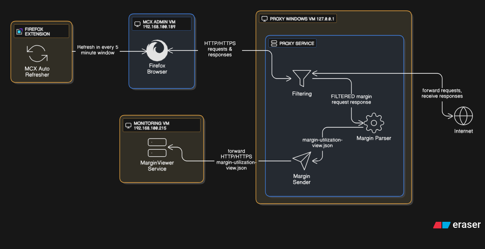

# Stateful Proxy Data Capture System

This document outlines the architecture, setup, and troubleshooting for a multi-component system built around a custom Mitmproxy Addon. The system captures credentials, logs specific network data, processes it, and transmits it via a non-blocking background process.

[View on Eraser](https://app.eraser.io/workspace/afaNtqxn3gFuGwoZLWi7)

## MCX AUTO REFRESHER FIREFOX ADD-ON:

> Source code is avaiable here [mcx_auto_refresher](https://github.com/varun-pal-singh/mcx-refresher)

It refreshes margin page every 5 minutes, it also guarantee that if some other user is using the admin site so it will always get 5 minutes window to do his job.

## PROXY SERVICE 

It consists of three services, i.e., 

- Filtering (./mcx_stateful_proxy.py), 
- Parser (./parser/margin_table_parser.py), 
- Sender (./client/margin_data_sender.py)

### Filtering (./mcx_stateful_proxy.py)

There are two main hooks for this add-on, i.e., request(flow), response(flow), 

> def request(self, flow: http.HTTPFlow):

> def response(self, flow: http.HTTPFlow):

Rest all are utility functions to help these two hooks, namely

> def _save_credentials(creds: dict):

> def _is_target(self, flow: http.HTTPFlow) -> bool:

> def _is_unfiltered(self, flow: http.HTTPFlow) -> bool

> def _record_request_flow(self, flow: http.HTTPFlow):

> def _record_response_flow(self, flow: http.HTTPFlow):

> def _update_from_request(self, flow: http.HTTPFlow):

> def _update_from_response(self, flow: http.HTTPFlow):

> def _rewrite_margin_request(self, flow: http.HTTPFlow):

Every request and response from firefox, will pass through these two hooks only, so here we are doing some work to ensure we get latest uncurrpted data.

I will discuss the flow for request, and response flow will be similar to that only

1. First we filter the request, and checks if the request is coming from our target (***self.is_target(flow)***) url else no need to check and return simply

2. Then we check if the get default request by (***self.is_unfiltered(flow)***) else we don't have to record it, as it may be a filter margin request for some perticular user, we don't have to care about it

3. If request is coming from our ./client/mcx_margin.py (our custom client to get the margin data), then we fill the credentials to it from our ./config/credentials.json file (***self._rewrite_margin_request(flow)***).

4. Then at last we are recording the request and response in request and response folder defined in config.ini file, respectively, first we check (***_record_request_flow(flow)*** and ***_record_response_flow(flow)***) if we already have these files in our request and response folder, if yes, then we will save them as *prev_request.txt* and *prev_response.txt* first, then only proceed to save them *curr_request.txt* and *curr_response.txt*.

5. Lastly we update and record, the credentials (cookies, IXHRts, Rndaak) in ./config/credentials.json file (***_update_from_request*** and ***_update_from_response***) from every request that is coming from our target url and save it by using ***_save_credentials(dict)***.

### Margin Parser (./parser/margin_table_parser.py)

> def parse_response():   

it parse curr_response.txt file made in calls/browser/responses after filtering in _record_response_flow(), every 10 seconds to ensure data accuracy.

### Margin Sender (./client/margin_data_sender.py)

> def send_data():    

it sends data to remote VM provided in config.ini file, every 10 seconds.

