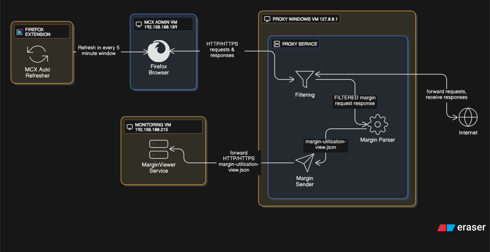

# Project Documentation: Stateful Proxy Data Capture System

This document outlines the architecture, setup, and troubleshooting for a multi-component system built around a custom Mitmproxy Addon. The system captures credentials, logs specific network data, processes it, and transmits it via a non-blocking background process.

[View on Eraser](https://app.eraser.io/workspace/afaNtqxn3gFuGwoZLWi7)

